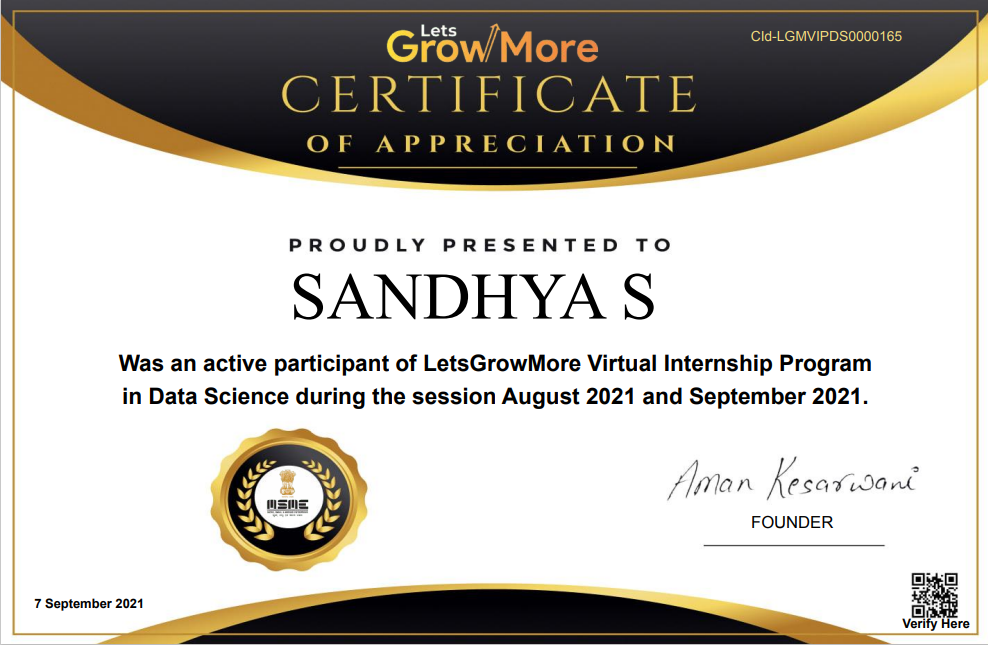

## _Data Science  Internship @LetsGrowMore - August '21_
|        | _Task_ | _Date_ |
| ------ | :----| :---------- |
| _#1_ | [_Iris Flower Classification using Supervised ML_](TASKS/%231/Description.md) | _09 August_ |
| _#4_ | [_Image to Pencil Sketch with Python_](TASKS/%234/Description.md) | _03 August_ |
| _#6_ | [_Prediction using Decision Tree Algorithm_](TASKS/%236/Description.md) | _05 August_ 
| _#7_ | [_MNIST Handwritten Digit Classification_](TASKS/%237/Description.md) | _12 August_ 
---
_Welcome Letter_ |  _Completion Certificate_
:-----------------------:|:-------------------------:
| 
---
