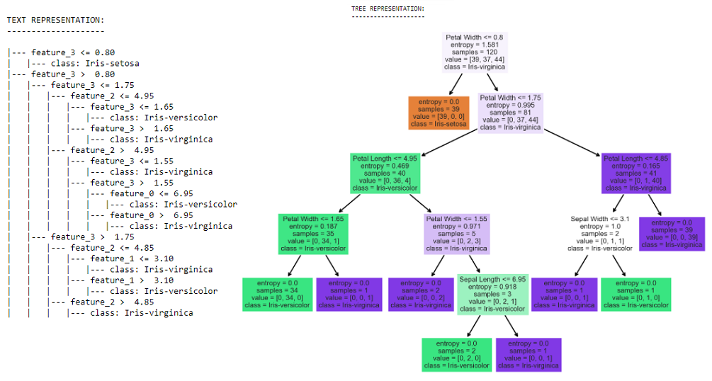

# _Task #6: Prediction using Decision Tree  Algorithm_ 
### _Date: 05 August '21_
---
* ### _Problem Statement:_
> **_Create the Decision Tree classifier and visualize it graphically. The purpose is if we feed any new data to this classifier, it would be able to predict the right class accordingly._**
* ### _Level: Intermediate_
* ### _Dataset: [iris.csv](Iris.csv)_
* ### _Implementation: [Prediction using Decision Tree  Algorithm.ipynb](https://github.com/sansuthi/LGMVIP-Data-Science/blob/main/TASK%20%236/Task%20%236%20Prediction%20using%20Decision%20Tree%20Algorithm.ipynb)_
### 
---

