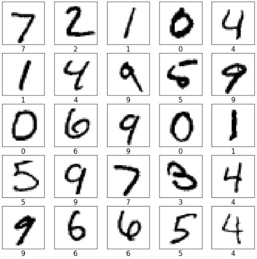

# _Task #7: MNIST Handwritten Digit Classification_ 
* ### _Level: Advanced_
* ### _Description:_
> **_Develop A Neural Network That Can Read Handwriting: Begin your neural network machine learning project with the MNIST Handwritten Digit Classification Challenge and using Tensorflow and CNN. It has a very user-friendly interface that’s ideal for beginners. Dataset can be seen on MNIST or can find [here](https://en.wikipedia.org/wiki/MNIST_database)._**
* ### _Implementation: [MNIST Handwritten Digit Classification.ipynb](MNIST%20Handwritten%20Digit%20Classification.ipynb)_
* ### _LinkedIn Post: [Link](https://www.linkedin.com/posts/sansuthi_lgmvipaug21-internship-letsgrowmore-activity-6831567351851343872-frt4)_
* ### _Sample Prediction:_

---
